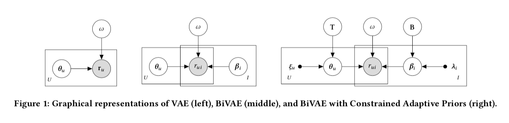

# BiVAE: Bilateral Variational Autoencoder

This is the code for the paper:

**[Bilateral Variational Autoencoder for Collaborative Filtering]()**
<br>
[Quoc-Tuan Truong](http://www.qttruong.info/), [Aghiles Salah](http://saghiles.github.io/), and [Hady W. Lauw](http://www.hadylauw.com/)
<br>
Presented at [WSDM 2021](https://www.wsdm-conference.org/2021/)



If you find the code and data useful in your research, please cite:

```
@inproceedings{truong2021bilateral,
  title={Bilateral Variational Autoencoder for Collaborative Filtering},
  author={Truong, Quoc-Tuan, Salah, Aghiles, and Lauw, Hady W},
  booktitle={ACM International Conference on Web Search and Data Mining, {WSDM} 2021}
  year={2021},
}
```

## How to run

```bash
pip install -r requirements.txt
```

Run BiVAE model:
```bash
python bivae.py -d office -k 20 -e '[40]' -a tanh -l pois -ne 500 -bs 128 -lr 0.001 -tk 50 -v
```

Run BiVAE model with Constrained Adaptive Priors (CAP):

- CAP requires feature learning, here we use vanilla VAE as an example:
```bash
# user side
python feature_learning.py -d office -w user -k 20 -e '[100]' -a tanh -l pois -ne 100 -bs 128 -lr 0.001 -s 123 -v

# item side
python feature_learning.py -d office -w item -k 20 -e '[100]' -a tanh -l pois -ne 100 -bs 128 -lr 0.001 -s 123 -v
```

- When user/item features are ready, we can train BiVAE with CAP:
```bash
python bivae_cap.py -d office -uc -ic -k 20 -e '[40]' -a tanh -l pois -ne 500 -bs 128 -lr 0.001 -tk 50 -v
```


## Contact
Questions and discussion are welcome: www.qttruong.info